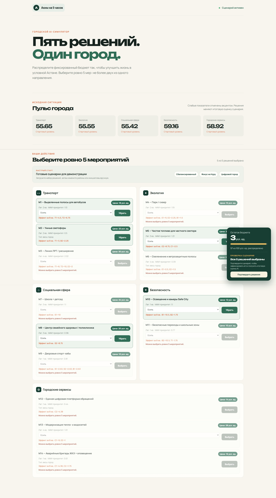
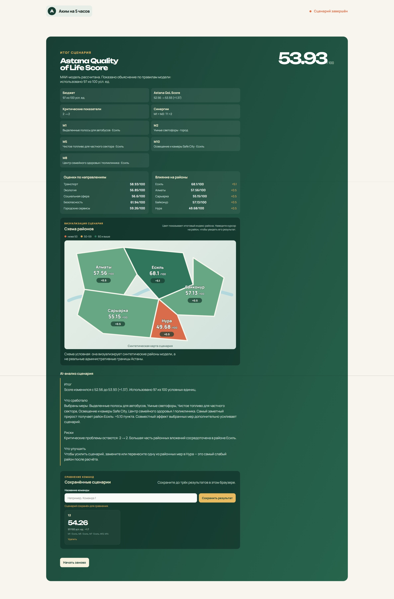

# AstanaSIM AI — «Аким на 5 часов»

Веб-симулятор для оценки управленческих решений в условном городе. Пользователь распределяет единый бюджет между городскими инициативами, моделирует последствия для районов и получает итоговую оценку **Astana Quality of Life Score** с понятным объяснением от AI.

## Интерфейс

### Выбор инициатив и контроль бюджета



### Итоговый дашборд, карта и AI-анализ



## 1. Проблема и пользователи

При развитии города нельзя улучшать транспорт, экологию, социальную инфраструктуру, безопасность и сервисы независимо друг от друга: бюджет ограничен, а решение в одном направлении способно улучшить или ухудшить другой показатель. В результате сложно быстро сравнивать сценарии и объяснять их компромиссы.

Проект предназначен для:

- городского управленца, который хочет проверить сценарий распределения бюджета;
- аналитика, который сравнивает влияние инициатив на районы;
- участника симулятора или хакатона, который учится принимать комплексные городские решения.

Все данные в текущей версии синтетические: проект не использует персональные, закрытые или оперативные городские данные.

## 2. Что реализовано

| Возможность | Что делает |
| --- | --- |
| Единые стартовые условия | Все сценарии начинаются с бюджета 100 условных единиц и одного набора районных показателей. |
| Каталог инициатив | Доступно 14 мероприятий в пяти направлениях: транспорт, экология, социальная сфера, безопасность и городские сервисы. |
| Выбор пяти решений | Можно выбрать ровно пять инициатив, максимум две из одного направления. |
| Контроль бюджета | Система не позволяет выбрать набор дороже 100 условных единиц. |
| Ограничения модели | Проверяются несовместимые мероприятия и условия выбора для отдельных инициатив. |
| Пересчёт в реальном времени | До подтверждения показываются выбранные меры, расходы, остаток бюджета и ожидаемые изменения. |
| Итоговый экран | После подтверждения сценария открывается отдельная страница с бюджетом, общим баллом, оценками направлений, изменениями по районам и синергиями. |
| Схема районов | На итоговом экране показана интерактивная условная карта пяти синтетических районов: цвет отражает индекс, а подсказка — точное изменение. |
| Демо-сценарии | Три готовых набора — «Сбалансированный», «Фокус на Нуру» и «Цифровой город» — заполняют выбор для быстрого показа. |
| Сравнение команд | До трёх результатов можно сохранить в браузере по названию команды и сравнить по Score, приросту и бюджету. |
| Серверная валидация | Сервер заново проверяет идентификаторы, районы, бюджет, ограничения и рассчитывает Score из канонического JSON. Клиентские цены и результаты не принимаются на доверии. |
| Защита локальных секретов | Веб-сервер раздаёт только публичные файлы приложения; прямой доступ к `.env`, исходному Python-коду и служебным каталогам закрыт. |
| AI-анализ | Сервер передаёт рассчитанный результат в OpenAI API и получает текстовое объяснение сильных сторон, рисков и рекомендации. |
| Надёжный fallback | Если ключ отсутствует, API недоступен или отвечает ошибкой, сервер создаёт детерминированный анализ по уже рассчитанным данным — итог не остаётся пустым. |
| Прозрачные данные | Параметры районов, веса, меры, эффекты, синергии и ограничения вынесены в редактируемый JSON. |
| Проверка модели | Девять Python-тестов проверяют базовый Score, контрольный и демо-сценарии, бюджет, ограничения, районы и защиту сервера от подмены клиентских значений. |

## 3. Как работает решение

1. Приложение загружает исходные показатели пяти условных районов и параметры модели из `data/model-data.json`.
2. Пользователь загружает один из трёх демо-сценариев либо вручную выбирает пять мер и назначает район там, где это требуется.
3. Интерфейс сразу проверяет бюджет, лимит в два решения на направление, несовместимость мер и дополнительные условия.
4. После подтверждения браузер передаёт серверу только коды мер и районы. Единое ядро `model_engine.py` повторно проверяет сценарий и применяет эффекты, временные лаги и синергии.
5. Рассчитываются новые районные индексы, средний городской индекс, минимальный районный индекс, критические показатели и итоговый Astana Quality of Life Score. Условная карта окрашивает районы по их итоговому индексу.
6. На экран результата выводятся численные итоги. Затем OpenAI API формирует человеческое объяснение; при недоступности API его заменяет встроенный детерминированный анализ.
7. Результат можно сохранить под названием команды и сравнить ещё с двумя сценариями в этом браузере. Кнопка «Начать заново» возвращает к исходному экрану.

## 4. Математическая модель

### Показатели

Каждый из десяти показателей имеет шкалу от 0 до 100: чем больше значение, тем лучше. Районный индекс — взвешенная сумма его показателей:

$$
D_d = \sum_{k=1}^{10} w_k \cdot x_{d,k}
$$

где $D_d$ — индекс района, $x_{d,k}$ — значение показателя $k$ в районе $d$, а $w_k$ — вес критерия $k$. Сумма всех весов равна 1.

| Код | Критерий | Вес |
| --- | --- | ---: |
| T1 | Скорость и доступность транспорта | 0,10 |
| T2 | Надёжность общественного транспорта | 0,10 |
| E1 | Обеспеченность зелёными зонами | 0,09 |
| E2 | Качество воздуха | 0,11 |
| S1 | Доступность социальных объектов | 0,11 |
| S2 | Качество социальных услуг | 0,11 |
| B1 | Уровень преступности и личной безопасности | 0,09 |
| B2 | Безопасность улиц и дорог | 0,09 |
| C1 | Качество коммунальной инфраструктуры | 0,10 |
| C2 | Доступность цифровых городских сервисов | 0,10 |

Городской средний индекс учитывает население районов:

$$
D_{avg} = \sum_d p_d \cdot D_d
$$

где $p_d$ — доля населения района $d$. Минимальный индекс $D_{min}$ — значение самого отстающего района.

### Итоговый Astana Quality of Life Score

$$
\text{Score} = 0{,}7 \cdot D_{avg} + 0{,}3 \cdot D_{min} - N_{crit}
$$

$N_{crit}$ — количество показателей со значением ниже 40. Таким образом, модель одновременно поощряет рост качества жизни в среднем по городу, поддерживает самый слабый район и штрафует сценарии, оставляющие критические проблемы.

Для меры могут задаваться:

- прямое изменение конкретного показателя;
- временной лаг в кварталах;
- эффект для всего города;
- синергия двух совместимых мероприятий;
- ограничение совместимости выбранных мероприятий.

Расчёт выполняется детерминированно единым серверным ядром `model_engine.py`, поэтому один и тот же набор решений всегда даёт один и тот же численный результат. Браузер не передаёт серверу готовый Score, цены или эффекты. AI объясняет проверенный расчёт, но не заменяет его.

## 5. Исходные данные

В модели пять условных районов. Начальный общий Score — **52,56**.

| Район | Население | Стартовый районный индекс | Характерный вызов |
| --- | ---: | ---: | --- |
| Есиль | 0,27 | 62,99 | Транспортная нагрузка и социальная инфраструктура. |
| Алматы | 0,24 | 57,06 | Состояние коммунальной инфраструктуры и транспорт. |
| Сарыарка | 0,20 | 54,65 | Экология и городская среда. |
| Байконур | 0,13 | 56,63 | Уличная безопасность и сервисы. |
| Нура | 0,16 | 49,18 | Наиболее слабый район, требующий приоритетного внимания. |

Направления инициатив:

| Направление | Примеры доступных решений |
| --- | --- |
| Транспорт | Выделенные автобусные полосы, умные светофоры, линия ЛРТ или расширение. |
| Экология | Парк или сквер, чистое топливо, озеленение и ветрозащитные полосы. |
| Социальная сфера | Школа и детсад, центр семейного здоровья, спортивные хабы. |
| Безопасность | Освещение и камеры Safe City, безопасные переходы и школьные зоны. |
| Городские сервисы | Единая цифровая платформа обращений, модернизация сетей, аварийные бригады ЖКХ. |

Полный набор исходных цифр, стоимостей, эффектов и правил находится в [data/model-data.json](D:/Project/hack-bc9ad702-it-solution/data/model-data.json).

## 6. Правила сценария

| Правило | Значение |
| --- | --- |
| Общий бюджет | 100 условных единиц |
| Горизонт моделирования | 8 кварталов |
| Число решений | Ровно 5 |
| Лимит направления | Не более 2 мер из одного направления |
| Критический показатель | Значение ниже 40 |
| Превышение бюджета | Заблокировано интерфейсом и моделью |

## 7. Технологии

| Область | Использование в проекте |
| --- | --- |
| Клиентская часть | HTML, CSS, JavaScript без внешнего frontend-фреймворка. |
| Интерфейс | `app.js`: выбор решений, демо-сценарии, вызов API, карта и локальное сравнение результатов. |
| Ядро модели | `model_engine.py`: единая серверная реализация валидации, эффектов, синергий и формулы Score. |
| Данные модели | JSON-файл `data/model-data.json`. |
| Сервер | Python стандартной библиотеки (`http.server`, `urllib`) в `server.py`. |
| AI | OpenAI Responses API; используемая модель задаётся переменной `OPENAI_MODEL` (по умолчанию `gpt-5-mini`). |
| Настройка ключа | Переменные окружения в локальном файле `.env`; `run.bat` на Windows и `run.command` на macOS запрашивают ключ, если файла или ключа нет. |
| Тесты | Python `unittest`, без сторонних зависимостей. |

## 8. Архитектура

```text
data/model-data.json
   ├────────► app.js ─────────► index.html + styles.css
   │             │                   │
   │             │ коды мер          │ выбор, карта, localStorage
   │             ▼                   ▼
   └────► model_engine.py ◄──── server.py
                ▲                   │
                │                   ├────► OpenAI API
       tests/model_test.py          │          │
                                    └─ fallback
                                         │
                              итоговый Score и объяснение
```

Компоненты взаимодействуют так:

- `index.html` задаёт структуру стартового и итогового экранов;
- `styles.css` отвечает за адаптивность, анимацию ожидания AI и плавающую карточку бюджета;
- `app.js` загружает каталог, управляет выбором, вызывает API и хранит до трёх сравнений в `localStorage`;
- `server.py` раздаёт приложение, публикует `/api/health`, `/api/model-summary`, `/api/simulate` и `/api/analyze`;
- `model_engine.py` является единственным ядром итогового расчёта для приложения и тестов;
- `run.bat` и `run.command` подготавливают окружение и запускают сервер на Windows и macOS;
- `tests/model_test.py` импортирует рабочее ядро и проверяет модель и защиту от подмены клиентских значений.

## 9. Установка и запуск

### Требования

- Windows или macOS;
- установленный Python 3 (`py` на Windows или `python3` на macOS);
- ключ OpenAI API — только для получения внешнего AI-анализа. Без ключа приложение и математическая модель продолжают работать, а текст анализа создаётся встроенным fallback.

### Запуск на Windows

1. Откройте терминал в папке проекта.
2. Запустите:

   ```bat
   run.bat
   ```

### Запуск на macOS

Рекомендуемый способ — запуск через Terminal. Он не требует отключать Gatekeeper или менять настройки безопасности:

```bash
cd /путь/к/hack-bc9ad702-it-solution
bash run.command
```

Если macOS уже переместила `run.command` в корзину после двойного нажатия, восстановите файл из корзины или заново получите репозиторий, а затем запустите его указанной выше командой. Это реакция Gatekeeper на скачанный скрипт без подписи Apple, а не ошибка запуска проекта.

Для запуска через Finder нажмите на `run.command` правой кнопкой, выберите **Открыть**, затем ещё раз подтвердите **Открыть**. Если такой кнопки нет, используйте рекомендуемый запуск через Terminal.

При первом запуске любой из скриптов создаст `.venv`. Если `OPENAI_API_KEY` ещё не задан, скрипт предложит вставить ключ. При пустом вводе приложение всё равно запустится, а объяснение результата сформирует детерминированный fallback. В `.env` не записывается шаблонный или выдуманный ключ.

После запуска браузер автоматически откроет веб-приложение. Если этого не произошло, откройте адрес, показанный в терминале. По умолчанию это [http://localhost:8081](http://localhost:8081). Если порт занят, скрипт автоматически выберет следующий свободный порт в диапазоне 8081–8090.

Файл `.env` не должен попадать в репозиторий: он содержит секретный ключ. Для смены модели достаточно указать в `.env`, например:

```env
OPENAI_MODEL=gpt-5-mini
```

### Если сценарий не подтверждается

Если основной порт занят старой версией сервера, скрипт запуска выведет предупреждение и запустит актуальную версию на следующем свободном порту. Откройте именно адрес из терминала. При сообщении «Сервер не рассчитал сценарий» выполните принудительное обновление страницы (`Ctrl+F5` на Windows или `Command+Shift+R` на macOS) и проверьте, что адрес и порт совпадают с указанными в терминале.

## 10. Как проверить решение

### Быстрая ручная проверка

1. Запустите приложение через `run.bat` на Windows или `run.command` на macOS.
2. Выберите пять инициатив; интерфейс должен показывать остаток бюджета и не дать превысить 100 условных единиц.
3. Убедитесь, что кнопка подтверждения появляется только после корректного выбора пяти решений.
4. Подтвердите сценарий. Отобразится анимация расчёта, затем — отдельный итоговый экран.
5. Проверьте, что показаны затраты, Score до и после, оценки направлений, влияние на районы, синергии и AI-анализ либо fallback-анализ.
6. Введите название команды и сохраните результат. Повторите сценарий ещё раз и проверьте сравнение результатов.
7. Нажмите «Начать заново» и убедитесь, что открывается исходный экран.

### Быстрая проверка демо-сценариев

| Сценарий | Бюджет | Итоговый Score | Прирост | Критические показатели |
| --- | ---: | ---: | ---: | ---: |
| Сбалансированный | 83 | 55,50 | +2,94 | 1 |
| Фокус на Нуру | 93 | 55,61 | +3,05 | 1 |
| Цифровой город | 78 | 55,75 | +3,19 | 1 |

Эти результаты детерминированы текущей версией `data/model-data.json` и проверяются автоматическим тестом.

### Контрольный сценарий

Для воспроизводимой проверки выберите следующие меры:

| Мера | Район | Стоимость |
| --- | --- | ---: |
| M7 — Школа + детсад | Нура | 24 |
| M8 — Центр семейного здоровья | Нура | 20 |
| M10 — Освещение и камеры Safe City | Нура | 12 |
| M12 — Единая цифровая платформа обращений | Город | 14 |
| M5 — Чистое топливо для частного сектора | Сарыарка | 25 |

Ожидаемый результат текущей модели: расходы **95** из 100, Score **52,56 → 56,54** (рост **+3,98**), критических показателей **0** и одна синергия M10 + M12 для Нуры.

### Автоматические тесты

Запустите:

```bat
test.bat
```

Скрипт при необходимости создаст виртуальное окружение и выполнит девять тестов: исходные данные, контрольный сценарий, обязательные пять уникальных решений, бюджет, ограничения, общегородской эффект, серверную перепроверку, три демо-набора и неверные идентификаторы/районы.

## 11. Данные и интеграции

| Источник или компонент | Роль |
| --- | --- |
| `data/model-data.json` | Единственный активный и достаточный источник модели в репозитории: районы, веса, стартовые оценки направлений, инициативы, эффекты, синергии и ограничения. |
| `model_engine.py` | Каноническая реализация расчёта, одинаково используемая сервером и автоматическими тестами. |
| OpenAI Responses API | Формирует текстовое объяснение рассчитанного сценария при наличии действующего ключа. |

Интеграция с OpenAI является дополнительной: финансовые расчёты, выбор инициатив и итоговый Score не зависят от ответа внешнего API.

## 12. Ограничения текущей версии

- Данные синтетические и предназначены для демонстрации, а не для реального бюджетного планирования.
- Результат — учебная модель с фиксированными весами и эффектами; он не заменяет экспертную, экономическую или общественную оценку.
- AI-анализ зависит от доступности и настроек OpenAI API. При ошибке используется локальный шаблонный анализ, а не языковая модель.
- Сравнения сохраняются только в `localStorage` текущего браузера: общей базы команд, авторизации и синхронизации между устройствами нет.
- Автоматический экспорт презентации не реализован.
- Деплой-версии в текущем репозитории нет: приложение запускается локально.

## 13. Дальнейшее развитие

Ближайшие задачи, которые усилили бы демонстрацию для жюри:

1. Добавить графики динамики показателей по кварталам рядом с уже реализованной схемой районов.
2. Реализовать неожиданное городское событие с необходимостью перераспределить бюджет.
3. Перенести сравнение команд из `localStorage` в общую базу с авторизацией.
4. Добавить отдельный расширенный режим модели с убывающей отдачей и сценарным анализом, сохранив базовую формулу неизменной для воспроизводимости.
5. Подготовить скриншоты или короткое видео основного пользовательского сценария для презентации проекта.
